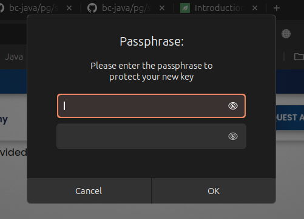

[Up](../readme.md)

### On linux
```
gpg --full-generate-key
```
In case of `gpg` is unknown command then just install it by
```
sudo apt install gnupg
```

Example of how it will look like for a case of all defaults:
```
developer@laptop:~/enc-dec-example/key-pair-gen$ gpg --full-generate-key
gpg (GnuPG) 2.4.4; Copyright (C) 2024 g10 Code GmbH
This is free software: you are free to change and redistribute it.
There is NO WARRANTY, to the extent permitted by law.

Please select what kind of key you want:
   (1) RSA and RSA
   (2) DSA and Elgamal
   (3) DSA (sign only)
   (4) RSA (sign only)
   (9) ECC (sign and encrypt) *default*
  (10) ECC (sign only)
  (14) Existing key from card
Your selection? 
Please select which elliptic curve you want:
   (1) Curve 25519 *default*
   (4) NIST P-384
   (6) Brainpool P-256
Your selection? 
Please specify how long the key should be valid.
         0 = key does not expire
      <n>  = key expires in n days
      <n>w = key expires in n weeks
      <n>m = key expires in n months
      <n>y = key expires in n years
Key is valid for? (0) 
Key does not expire at all
Is this correct? (y/N) y

GnuPG needs to construct a user ID to identify your key.

Real name: Denis B. Demidov
Email address: denis.b.demidov@gmail.com
Comment: Developer
You selected this USER-ID:
    "Denis B. Demidov (Developer) <denis.b.demidov@gmail.com>"

Change (N)ame, (C)omment, (E)mail or (O)kay/(Q)uit? O
We need to generate a lot of random bytes. It is a good idea to perform
some other action (type on the keyboard, move the mouse, utilize the
disks) during the prime generation; this gives the random number
generator a better chance to gain enough entropy.
gpg: directory '/home/developer/.gnupg/openpgp-revocs.d' created
gpg: revocation certificate stored as '/home/developer/.gnupg/openpgp-revocs.d/AB66AFC993CCAFAA904216722A244CEACF5C9312.rev'
public and secret key created and signed.

pub   ed25519 2025-01-24 [SC]
      AB66AFC993CCAFAA904216722A244CEACF5C9312
uid                      Denis B. Demidov (Developer) <denis.b.demidov@gmail.com>
sub   cv25519 2025-01-24 [E]
```
Note: Here `AB66AFC993CCAFAA904216722A244CEACF5C9312` is **KeyId** which will be used below.

It also will ask passphrase in separated dialog:



Finally, do the next commands (in your case **KeyId** will be different):
```
gpg --export -a AB66AFC993CCAFAA904216722A244CEACF5C9312 > public.key
```
```
gpg --export-secret-key -a AB66AFC993CCAFAA904216722A244CEACF5C9312 > private.key
```

### On windows

Google it yourself and update this documentation.

### Online

[PGP Key Generator](https://pgpkeygen.com/)

